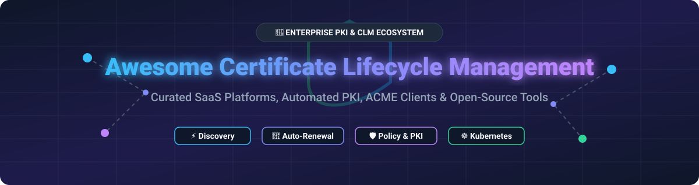

# 🔐 Awesome Certificate Lifecycle Management (CLM) & Enterprise PKI Ecosystem 🚀

   

## 📌 Executive Summary & Market Insights 📊

> **Estimated Market Size**: The global **Certificate Lifecycle Management (CLM)** market was valued at **$1.87 Billion in 2024** and is projected to reach **$4.92 Billion by 2032**, growing at a **CAGR of 12.8%**.
>
> **Market Dynamics**: The market is **moderately fragmented** but rapidly consolidating into **enterprise platform ecosystems**. Consolidation is driven by non-negotiable security trends: Google's shift to 90-day TLS certificate validity, strict DevOps machine identity management requirements, and Post-Quantum Cryptography (PQC) readiness. While pure-play CLM providers compete with CA-native platforms, major cybersecurity leaders continue acquiring specialized CLM players (e.g., CyberArk/Palo Alto Networks acquiring Venafi for $1.54B; Haveli Investments acquiring AppViewX).

This curated repository tracks notable **SaaS platforms**, **enterprise PKI solutions**, and **open-source GitHub projects** for **Certificate Lifecycle Management (CLM)**. These tools automate discovery, issuance, renewal, revocation, and compliance tracking for X.509, TLS/SSL, and SSH certificates across hybrid and multi-cloud environments—preventing catastrophic outages and enforcing cryptographic policy.

---

## 📋 Table of Contents 📑

- [🌐 SaaS & Commercial CLM Platforms](#-saas--commercial-clm-platforms)
- [💻 Open-Source GitHub Projects](#-open-source-github-projects)
- [🤝 How to Contribute](#-how-to-contribute)
- [☕ Support & Community](#-support--community)
- [📈 Star History](#-star-history)
- [⚠️ Disclaimer](#-disclaimer)

---

## 🌐 SaaS & Commercial CLM Platforms ☁️

Below is a comparative breakdown of commercial and SaaS certificate lifecycle management platforms, sorted by **company scale (valuation / revenue)** in descending order.

| Platform / Vendor 🏢 | Company Scale (Valuation / Revenue) 💰 | Pricing (Starting Tier) 💵 | Free Tier Limits / Free Trial 🎁 | Description & Core Features ⚡ |
| :--- | :--- | :--- | :--- | :--- |
| **[DigiCert Trust Lifecycle Manager](https://www.digicert.com/)** | **~$2.0B+ Valuation** ($1B+ Annual Revenue) | **$26 / domain / month** (billed annually for standard SSL subscriptions) | **No Free Tier**; Custom 30-day enterprise trial tenant via sales demo | Full-suite certificate discovery, governance, and automated issuance across public and private CAs. |
| **[Venafi (CyberArk / Palo Alto Networks)](https://venafi.com/)** | **$1.54B Valuation** ($150M+ ARR prior to acquisition) | **$4,166 / month** ($50,000 / year starting enterprise deployment quote) | **No Free Tier**; Custom demo & Proof of Concept (PoC) available on request | Enterprise machine identity management platform (TLS Protect / CyberArk Certificate Manager) for high-scale multi-cloud certificate governance. |
| **[Keyfactor](https://www.keyfactor.com/)** | **$1.3B Valuation** ($200M+ ARR) | **$1,250 / month** ($15,000 / year starting commercial estimate) | **30-Day Free Trial** (EJBCA Enterprise trial via AWS & Azure Marketplaces) | Enterprise PKI and CLM platform. Sponsors open-source EJBCA; bridges community and enterprise-grade PQC readiness. |
| **[Sectigo Certificate Manager](https://sectigo.com/)** | **$900M Valuation** (~$100M+ Revenue) | **$5 / month** ($60 / year starting DV certificate tier; custom CLM quotes) | **30-Day Free Trial** for Sectigo Certificate Manager (SCM) enterprise platform | Comprehensive CLM platform providing automated discovery, renewal, and cryptographic policy enforcement across heterogeneous CAs. |
| **[Entrust Certificate Hub](https://www.entrust.com/)** | **~$900M Revenue** (Privately held enterprise) | **$2 / user / month** (Cloud Identity & PKI starting tier) | **30-Day Free Trial** (Includes 30-day trials for KeyControl and Identity Essentials, 60-day for IIDaaS) | Enterprise certificate lifecycle management hub offering discovery, compliance reporting, and HSM-backed key protection. |
| **[AppViewX](https://www.appviewx.com/)** | **~$133M Revenue** (Acquired by Haveli Investments) | **$500 / month** ($6,000 / year base SaaS starter estimate) | **30-Day Free Trial** (AVX ONE PKIaaS / CLM trial environments on AWS Marketplace) | Modular CLM and network automation platform for automated certificate discovery, workflows, and SSH key management across multi-cloud environments. |
| **[GlobalSign Atlas](https://www.globalsign.com/)** | **~$133.6M Revenue** (Subsidiary of GMO GlobalSign Holdings) | **$20.83 / month** ($250 / year starting commercial certificate plan) | **No Free Tier**; 30-day money-back guarantee on certificate products | High-volume cloud-based automated certificate issuance and management engine for IoT and enterprise infrastructure. |
| **[ManageEngine Key Manager Plus](https://www.manageengine.com/)** | **~$57.4M Revenue** (Division of Zoho Corp) | **$39.58 / month** ($475 / year for 25 keys package) | **Free Plan**: Free forever up to **5 keys**; 30-day full-featured trial available | Key and certificate management solution for discovering, tracking, renewing, and auditing SSL/TLS certificates and SSH keys. |
| **[Fortanix](https://www.fortanix.com/)** | **~$35M Revenue** ($135M total funding raised) | **$250 / month** (Base Data Security Manager SaaS tier) | **30-Day Free Trial** (Full access to Data Security Manager Enterprise & Confidential Computing Manager) | Data security and CLM platform powered by Confidential Computing and HSM-backed key protection. |
| **[KeyTalk](https://www.keytalk.com/)** | **~$10M Revenue** (Private European IT Security vendor) | **$100 / month** ($1,200 / year base commercial starting quote) | **No Free Tier**; Custom evaluation trial licenses available upon sales engagement | Certificate & Key Management System (CKMS) delivering automated short-lived certificate issuance, client certificates, and internal PKI management. |

---

## 💻 Open-Source GitHub Projects 🛠️

Certificate lifecycle management boasts a **mature, production-proven open-source ecosystem**. Below are notable open-source repositories sorted by **GitHub Star Count** in descending order.

| Repository 📦 | Stars ⭐ | Primary License 📜 | Category & Description 🎯 |
| :--- | :--- | :--- | :--- |
| **[FiloSottile/mkcert](https://github.com/FiloSottile/mkcert)** |  | BSD-3-Clause | **Local Dev TLS**: Zero-config tool for making locally-trusted development certificates with custom CAs. |
| **[cert-manager/cert-manager](https://github.com/cert-manager/cert-manager)** |  | Apache-2.0 | **Kubernetes CLM**: De facto standard for automated TLS certificate issuance and renewal in Kubernetes clusters. |
| **[go-acme/lego](https://github.com/go-acme/lego)** |  | MIT | **ACME Library & CLI**: Pure Go ACME client supporting 100+ DNS providers for automated certificate management. |
| **[cloudflare/cfssl](https://github.com/cloudflare/cfssl)** |  | MIT | **PKI Toolkit**: Cloudflare's PKI/TLS Swiss Army knife featuring CLI utilities and an HTTP API server for signing, verifying, and bundling. |
| **[smallstep/certificates](https://github.com/smallstep/certificates)** |  | Apache-2.0 | **DevOps CA (`step-ca`)**: Modern online CA supporting ACME v2, OIDC, cloud identity provisioners, X.509, and SSH certificates. |
| **[caddyserver/certmagic](https://github.com/caddyserver/certmagic)** |  | Apache-2.0 | **Automatic TLS Library**: Fully-automated ACME TLS library powering Caddy, providing zero-touch certificate issuance and renewal. |
| **[Netflix/lemur](https://github.com/Netflix/lemur)** |  | Apache-2.0 | **Certificate Orchestration**: Netflix's TLS certificate management and orchestration platform for tracking and automated deployment. |
| **[webprofusion/certify](https://github.com/webprofusion/certify)** |  | MIT | **Windows ACME Client**: Professional GUI client (Certify The Web) for IIS and Windows environments powered by Let's Encrypt / ACME. |
| **[fabriziosalmi/certmate](https://github.com/fabriziosalmi/certmate)** |  | MIT | **CLM & Probe Tool**: Lightweight CLM with TLS probe discovery, CT-log monitoring, inventory management, and quantum readiness reports. |
| **[Keyfactor/ejbca-ce](https://github.com/Keyfactor/ejbca-ce)** |  | LGPL-2.1 | **Enterprise PKI Platform**: World's leading industrial-grade open-source CA and PKI platform supporting multiple CAs, CMP, EST, and OCSP. |
| **[openxpki/openxpki](https://github.com/openxpki/openxpki)** |  | Apache-2.0 | **Enterprise Trustcenter**: Flexible Perl-based enterprise PKI framework with workflow engine supporting SCEP, EST, and Web UI. |
| **[dogtagpki/pki](https://github.com/dogtagpki/pki)** |  | GPL-2.0 | **Enterprise PKI Suite**: Red Hat-backed full enterprise PKI suite containing CA, KRA, OCSP, TKS, and TPS modules. |
| **[oriolrius/pki-manager-web](https://github.com/oriolrius/pki-manager-web)** |  | AGPL-3.0 | **SSH & X.509 Web PKI**: Modern self-hosted web PKI for SSH host/user CA and X.509 certificates integrated with cert-manager. |
| **[deadbolthq/certhound-agent](https://github.com/deadbolthq/certhound-agent)** |  | MIT | **Fleet Inventory Agent**: Cross-platform single-binary Go agent for scanning local filesystems, Windows Certificate Store, and ACME renewals. |

---

## 🤝 How to Contribute 💡

Contributions are warmly welcome! Help us maintain the definitive reference for Certificate Lifecycle Management:

1. 🍴 **Fork** this repository.
2. 📝 **Add or edit** entries in `README.md` keeping formatting consistent.
3. 🔎 **Ensure details** include verified pricing/stars, official documentation links, and concise feature descriptions.
4. 🚀 **Submit a Pull Request** with a brief overview of your changes.

---

## ☕ Support & Community 💖

If this repository has saved you from expired certificate outages or helped you architect your enterprise PKI, consider supporting the project!

- ⭐ **Star** this repository to increase its visibility.
- 🔄 **Fork & Share** with your DevOps, Security, and Infrastructure teams.
- 💬 Join our community on [Discord](https://discord.gg/jc4xtF58Ve)!
- 💖 **Sponsor the Maintainer**: Support ongoing curated lists and open-source contributions via [GitHub Sponsors](https://github.com/sponsors/ishandutta2007).

---

## 📈 Star History 📉

---

## ⚠️ Disclaimer 📜

- This list is **community-curated** for informational and research purposes only.
- Certificate lifecycle management platforms interact with critical cryptographic keys; always ensure proper HSM/KMS integration, RBAC, and policy compliance before production deployment.
- Product pricing, financial valuations, and free tier parameters change frequently—please verify directly with vendors.

---

Made with ❤️ for PKI Engineers, Security Architects, DevOps Teams, and Machine Identity Specialists.

